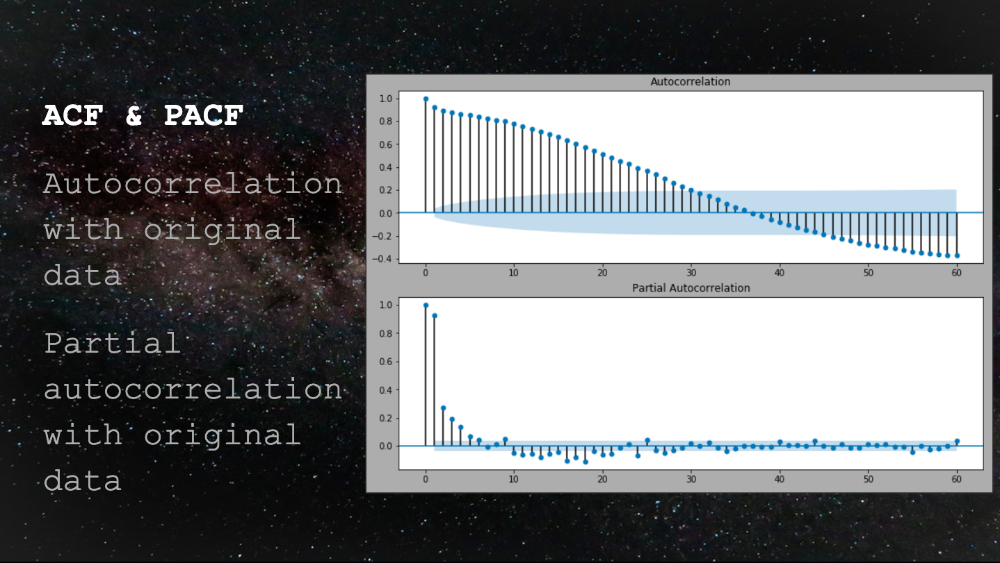
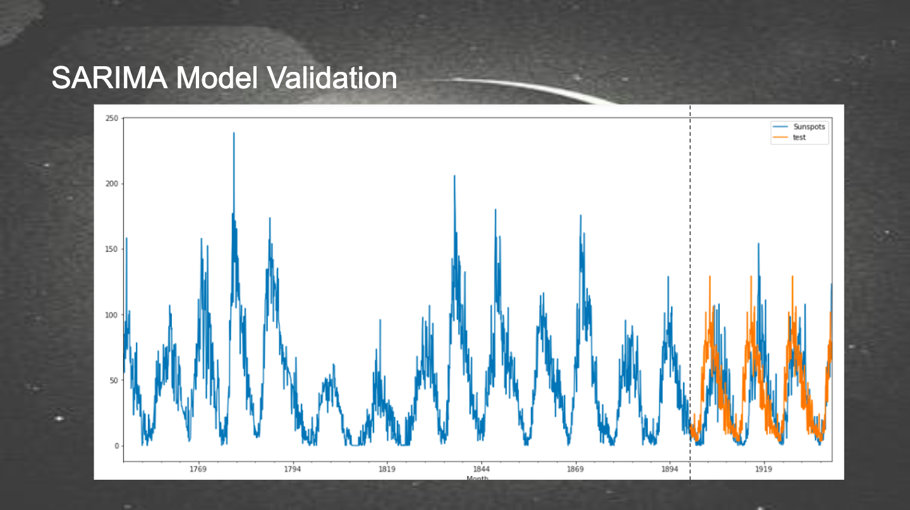
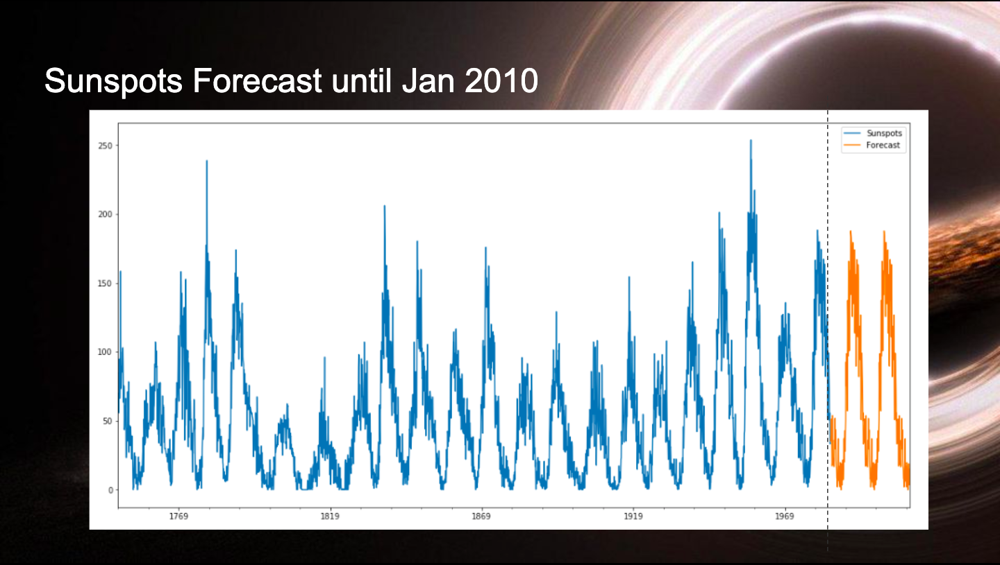

# Time Series Sunspots

### Purpose
To apply a Time Series Analysis to predict sunspots cycles and communicate the methodology and results of the anaylsis.

### The Data
Monthly count of sunspots taken every month for 234 years from 1749 to 1983 for 2808 datapoints.
- Astronomers have been tracking sunspots since almost the invention of telescopes. While they could see them, early on they did not know what sunspots were.

### What are sunspots?
Sunspots are now known to be vortices of cooler plasma (~3800K compared to 5800K temperature on the surface of the sun). They revolve across the surface of the sun in increasing frequency as the magnetic field activity in the sun's core increases. These sunspot occurrences are known to happen in cycles.

### Time Series Analysis
Dickey-Fuller Test indicates stationarity with p = 5.2x10e-14.  
To illustrate the autoregression and partial autoregression are appropriate models we did ACF and PACF plot with partial autoregression order 1. We show that a cycle period of 11 years does accurately model sunspot

### Metrics
AIC or Akaike information criterion is the metric we are going to use to evaluate our models. AIC is an estimator of the relative quality. We are using a grid search for appropriate hyper-parameters p, d, q.

p is the number of autoregressive terms,
d is the number of nonseasonal differences needed for stationarity, and
q is the number of lagged forecast errors in the prediction equation.

Best performing model is p = 1, d = 0, q = 2.

### Validation and Predictions

We used an 80-20 split for validation. Further work intended for cross-validation purposes however the results were reasonably accurate. We also extended the model to predict 27 years into the future until 2010. While our model accurately predicts the shape of the cycles our model did not find a lasting trend. With further refining, we might be able to find multi-decade cyclic trends in the data.

