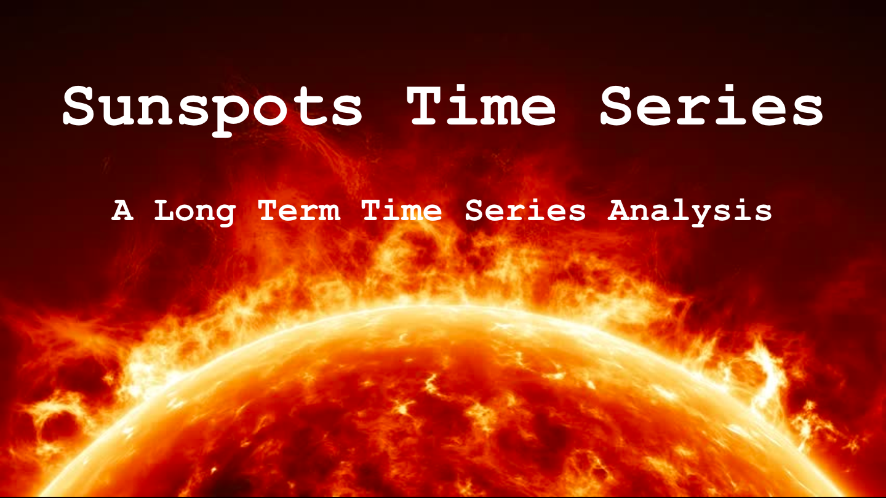

# Time Series Sunspots

### Purpose
To apply a Time Series Analysis to predict sunspots cycles and communicate the methodology and results of the anaylsis.

### The Data
Monthly count of sunspots taken every month for 234 years from 1749 to 1983.
- Astronomers have been tracking sunspots since almost the invention of telescopes. While they could see them, early on they did not know what sunspots were.

### What are sunspots?
Sunspots are now known to be vortices of cooler plasma (~3800K compared to 5800K temperature on the surface of the sun). 
